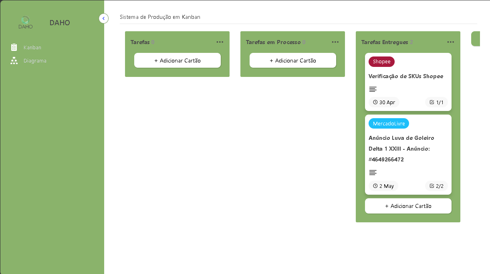
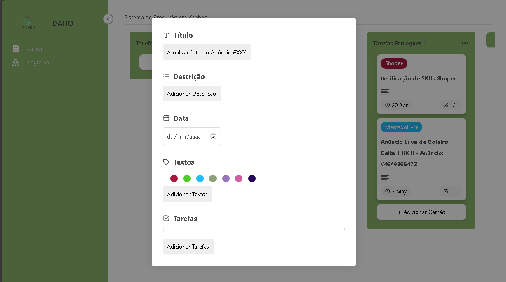
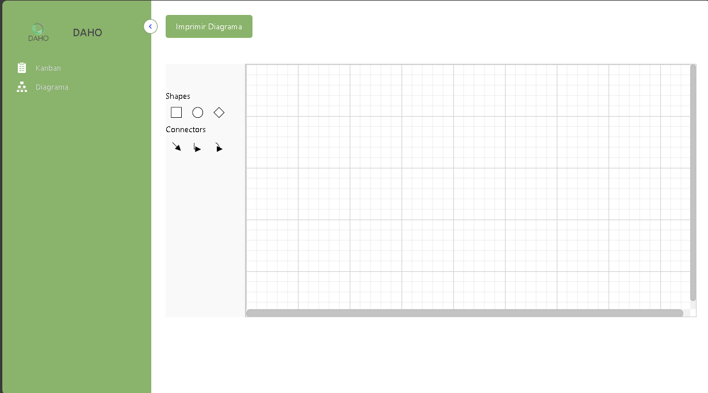

# Trello Kanban

O Trello Kanban é uma aplicação inspirada no Trello que permite gerenciar tarefas e projetos usando uma interface intuitiva. O projeto é desenvolvido em React Typescript, e inclui recursos como arrastar e soltar (drag-and-drop), integração com backend, e gerenciamento de tarefas com diversas funcionalidades. Desse modo, o projeto tem por objetivo melhorar a produtividade interna da Daho Store criando sistematização, transparência e ganho de otimização.

# `Home/Dashboard Page`

# `Task Management`

# `Diagram Management`

## Deploy

`https://daho-store.vercel.app/`

<a href="https://codewithsadee.github.io/grilli/"><strong>➥ Live Demo</strong></a>

# Functionalities

- Gerenciamento de Tarefas: Crie, edite e exclua cartões de tarefas em um board kanban.
- Arrastar e Soltar: Reorganize cartões entre diferentes boards.
- Integração com Backend: Sincronize dados com um servidor backend.
- Interface Intuitiva: Design responsivo e interativo.
- Customização de Tarefas: Adicione descrições, datas, rótulos, tarefas, e outros detalhes aos cartões.
